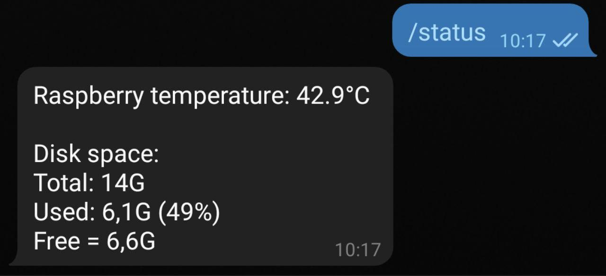

# raspberry-telegram-status
**raspberry-telegram-status** is a simple Telegram bot that send you the status of temperature and disk usage of your RaspberryPi.

## Setup your bot
1. Clone this repository or download it as zip
2. With a text editor open "config.json" and edit *token* and *admin* with your Telegram bot token and your chat id (this is important to avoid that unauthorized users can read your Raspberry status)
3. In your bot add new command "**/status**" using @BotFather 

## Requirements
- Python3
- python-telegram-bot (install via pip3)

## Run 
Run the bot whit `python3 main.py`

# License
This open-source software is published under the GNU General Public License (GNU GPL) version 3. Please refer to the "LICENSE" file of this project for the full text.
